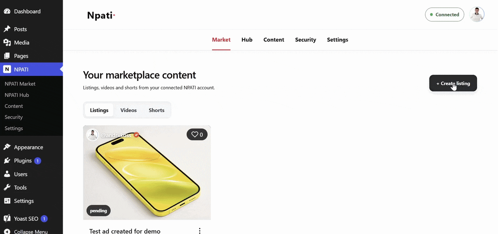
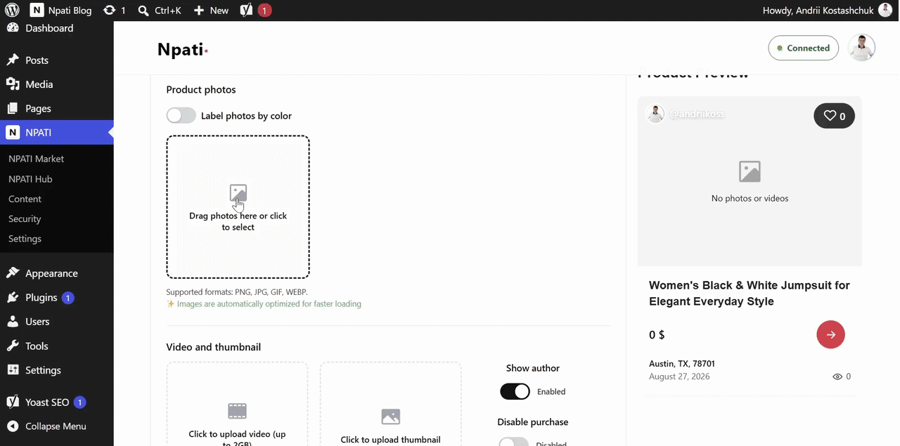
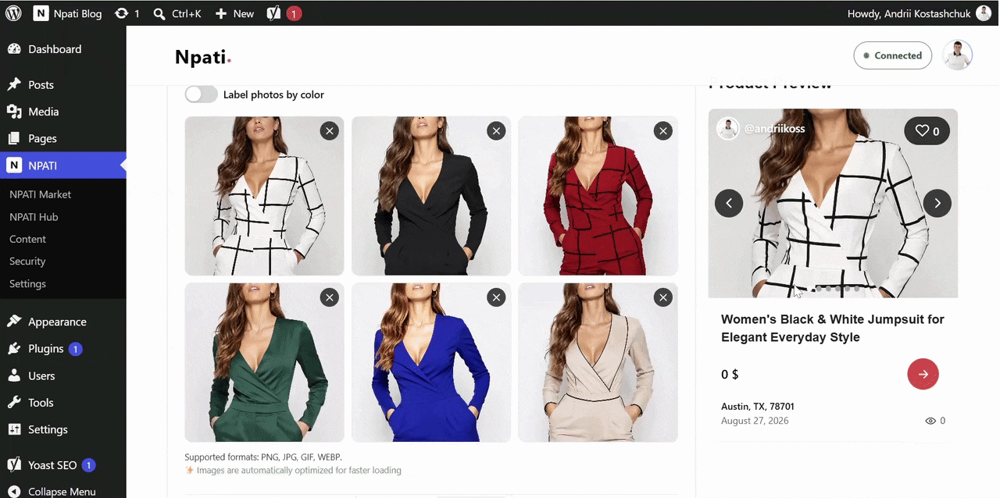
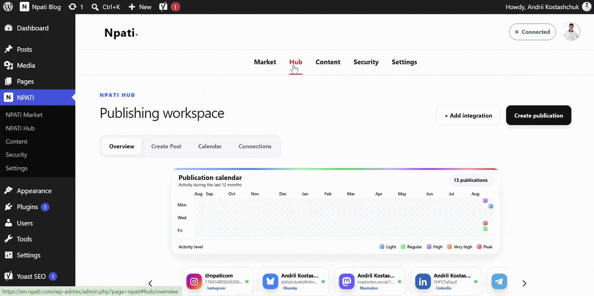
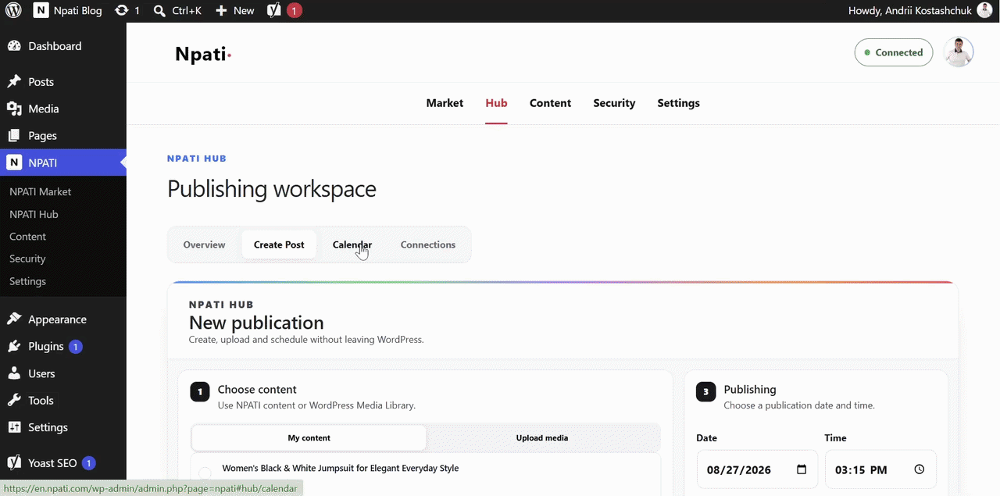
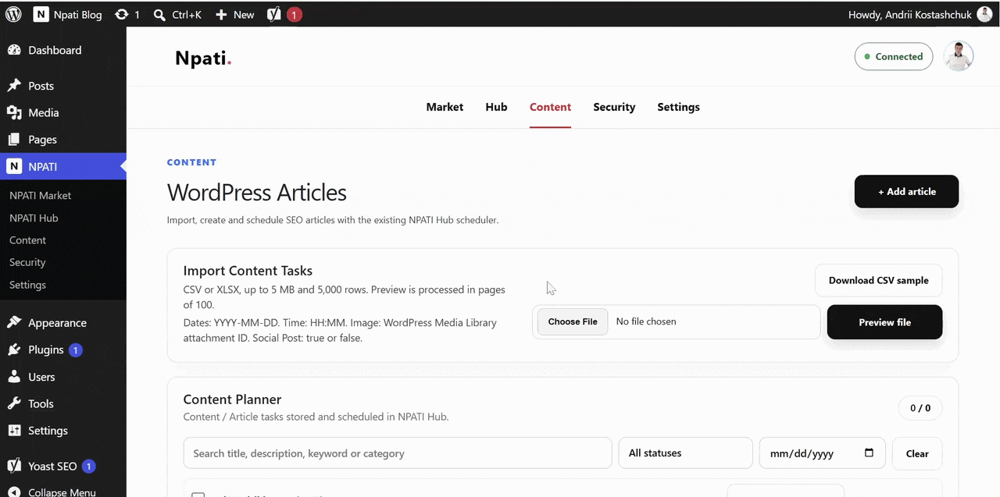
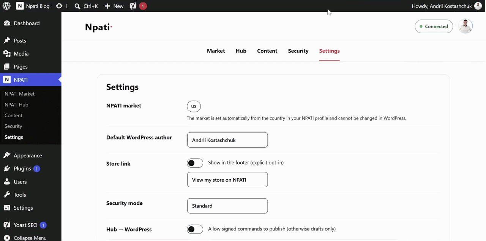

<h1 align="center"><strong>NPATI Content Automation for WordPress</strong></h1>

<p align="center">
  <a href="npati-hub.php"></a>
  <a href="https://www.php.net/"></a>
  <a href="LICENSE"></a>
  <a href="npati-hub.php"></a>
</p>

<p align="center">
  <a href="https://www.npati.com/plugins/npati-content-automation">Website</a> ·
  <a href="https://github.com/andrii-koss/npati-content-automation/tree/main/docs">Documentation</a> ·
  <a href="https://github.com/andrii-koss/npati-content-automation">Source Code</a>
</p>

**Create marketplace listings, schedule social media posts, plan WordPress articles, and use optional AI-assisted content creation from one WordPress dashboard.**

<p align="center">
  
</p>

[NPATI Content Automation](https://github.com/andrii-koss/npati-content-automation) connects WordPress to the [NPATI marketplace](https://www.npati.com/) and [NPATI Hub](https://www.npati.com/hub/). It gives sellers, creators, publishers, and small businesses one practical workspace for marketplace listings, video content, social media scheduling, editorial planning, and content automation.

The plugin itself is free to install and use. Connected third-party services may have their own pricing and usage terms. OpenAI is optional. If you connect your own OpenAI API key, OpenAI may charge your account for API usage according to its pricing and terms.

<h2 align="center"><strong>Getting started</strong></h2>

After installing and activating the plugin:

1. Open **NPATI** in the WordPress admin menu.
2. Sign in to your existing NPATI account or create a new account.
3. Review and approve the requested connection permissions.
4. Return to WordPress and start using the **Market**, **Hub**, and **Content** workspaces.

An NPATI account is required for connected marketplace and Hub features. An OpenAI account and API key are needed only for optional AI-assisted writing.

<h2 align="center"><strong>Market: listings, videos, and shorts</strong></h2>

The **Market** workspace has three sections:

- **Listings:** Create and manage marketplace listings.
- **Videos:** Watch videos from your NPATI profile and respond to comments.
- **Shorts:** View the Shorts published in your NPATI profile.

### Create a listing

Open **Market > Listings** and select **Create listing**. Start with the core product information:

- **Title:** Write a clear product name of up to 60 characters.
- **Category:** Select the category that best matches the item.
- **Product description:** Explain the item's features, condition, and important details in up to 2,000 characters.

### Add product photos and preview the listing

The **Product photos** area accepts up to six images. Drag files into the upload area or select them from your device. The live preview on the right shows how the listing will appear, and its carousel controls let you review every uploaded image before publication.

<p align="center">
  
</p>

After uploading the photos, use the preview panel to check their order and presentation. Select the navigation controls on either side of the preview to move through the carousel and inspect each image before publishing the listing.

<p align="center">
  
</p>

### Label photos by color

Enable **Label photos by color** to add a color label to each image. This helps shoppers understand which product color or variation is shown in each photo.

<p align="center">
  
</p>

### Combine six photos with a product video

In **Video and thumbnail**, upload a product video of up to 2 GB. The plugin creates a thumbnail automatically. You can build a listing with six photos plus one video. The preview shows the product photos first, followed by the video. When you reach the video in the carousel, playback starts automatically.

<p align="center">
  
</p>

### Create a larger video-first listing

For a video-focused presentation, remove the product photos and keep the video and thumbnail. The preview switches to a larger video layout. Choose either a photo-rich listing with video or a larger video-first card based on the product and your preferred presentation.

<p align="center">
  
</p>

### Set the price and publish

Add the price, review the listing preview, and publish. The new listing appears in the plugin and in your connected NPATI account.

<p align="center">
  
</p>

For more listing tips, read [How to Create a Listing on NPATI](https://en.npati.com/how-to-create-a-listing-on-npati/).

### Videos

The **Videos** section displays videos uploaded to your NPATI profile. Watch them in the WordPress workspace and reply to viewer comments.

<p align="center">
  
</p>

### Shorts

The **Shorts** section displays the short-form videos from your NPATI profile, allowing you to review them from WordPress.

<h2 align="center"><strong>Hub: social media scheduling and publishing</strong></h2>

The **Hub** workspace brings connected publishing destinations and scheduled social media content into WordPress. It includes **Overview**, **Create Post**, **Calendar**, and **Connections**.

### Overview

Use **Overview** to see upcoming publications, recent activity, calendar markers, and the integrations connected to your NPATI Hub account.

<p align="center">
  
</p>

### Create Post

Use **Create Post** to create and schedule a post for a supported social service connected to your NPATI Hub account. Select the destination, add the content, and choose the publication date and time. You can edit the scheduled post when needed.

<p align="center">
  
</p>

### Calendar and Connections

The **Calendar** shows scheduled and published posts and reposts. **Connections** displays the services linked to your NPATI Hub account.

To add another integration, open [NPATI Hub](https://www.npati.com/hub/) and complete the provider's secure authorization flow. Facebook, Instagram, and other providers open their own login pages. After you approve access, you return to the WordPress workspace and the connection becomes available in the plugin.

<p align="center">
  
</p>

<h2 align="center"><strong>Content: WordPress article planning</strong></h2>

The **Content** workspace is a WordPress content planner for SEO articles and scheduled publishing. You can:

- Add an article brief with a title, description, keywords, category, date, and time.
- Write content manually or use optional OpenAI-assisted generation.
- Import up to 5,000 tasks from a CSV or XLSX file of up to 5 MB.
- Preview imported rows before saving them.
- Search, filter, edit, copy, reschedule, delete, or bulk-delete planned articles.
- View scheduled and published articles in the content calendar.
- Prepare concise social media copy after an article is published and schedule it for a connected destination.

<p align="center">
  
</p>

To use AI writing or automated text generation, connect your own OpenAI API key and select a compatible model under **Settings**. All non-AI planning and scheduling features remain available without OpenAI.

<h2 align="center"><strong>Settings</strong></h2>

The **Settings** page gives administrators control over the WordPress and NPATI Hub connection:

- **Default WordPress author:** Choose the default author for created content.
- **Store link:** Explicitly opt in to showing a link to your NPATI Store in the site footer.
- **Security mode:** Select the preferred security level.
- **Hub to WordPress:** Allow signed commands to publish. When disabled, incoming content is limited to drafts.
- **Audit retention:** Keep activity records for 7, 30, or 90 days.
- **Uninstall cleanup:** Choose whether uninstalling removes plugin settings and local integration tables.

### OpenAI connection

OpenAI integration is optional and uses your own API key. The key is encrypted and stored only on your WordPress site; it is never sent to NPATI Hub. From **Settings**, you can:

- Connect or replace an OpenAI API key.
- Test the connection and load compatible models.
- Select the model you want to use.
- Save the configuration or disconnect OpenAI.

<p align="center">
  
</p>

<h2 align="center"><strong>Security</strong></h2>

The **Security** page provides a clear status view for:

- HTTPS availability.
- The NPATI Hub connection.
- Webhook signature verification.
- Social token storage status. Social access tokens are never stored in WordPress.
- Recent activity, including successful and failed connection, API, and webhook events.

Remote publishing is disabled by default. Administrators can explicitly allow signed NPATI Hub commands to publish; otherwise, incoming content remains in draft status.

<h2 align="center"><strong>Who is this plugin for?</strong></h2>

|     | Best for                               | How it helps                                                                      |
| --- | -------------------------------------- | --------------------------------------------------------------------------------- |
| 🛍️  | **Local sellers and online stores**    | Create rich product listings in WordPress and publish them to your NPATI account. |
| 🏪  | **Small businesses**                   | Manage marketplace content and connected social channels from one workspace.      |
| 🎬  | **Creators and video marketers**       | Work with videos, Shorts, photo carousels, and video-first listings.              |
| ✍️  | **Bloggers and publishers**            | Plan SEO-focused WordPress articles manually or with optional AI assistance.      |
| 📣  | **Social media managers and agencies** | Schedule posts for connected services and review activity in a shared calendar.   |
| ⚙️  | **WordPress administrators and teams** | Control publishing permissions, integrations, security status, and audit history. |

<h2 align="center"><strong>What makes it different?</strong></h2>

| Feature                                         | Why it matters                                                                                          |
| ----------------------------------------------- | ------------------------------------------------------------------------------------------------------- |
| **Marketplace, content, and social publishing** | Manage several publishing workflows without leaving WordPress.                                          |
| **Direct NPATI listing workflow**               | Build a listing in the plugin and publish it to the connected NPATI profile.                            |
| **Rich photo and video listings**               | Upload up to six product photos, label colors, add video, and preview the result before publishing.     |
| **NPATI Hub integrations**                      | Connect supported services through secure provider authorization and schedule content from WordPress.   |
| **Editorial planner and bulk import**           | Create tasks manually or import CSV/XLSX files, then edit, reschedule, copy, or remove planned content. |
| **Optional OpenAI connection**                  | Choose an available model and generate content only when you decide to use AI features.                 |
| **Privacy-focused connection model**            | Social access tokens stay in NPATI Hub and are never stored in WordPress.                               |

<h2 align="center"><strong>Requirements and installation</strong></h2>

### Requirements

- WordPress 6.4 or later.
- PHP 7.4 or later.
- An NPATI account for marketplace and connected Hub features.
- An OpenAI API key only for optional AI features.

### Install from GitHub

A stable GitHub Release is not available yet. To install the current source version:

1. Open the [GitHub repository](https://github.com/andrii-koss/npati-content-automation), select **Code**, and choose **Download ZIP**.
2. In WordPress, open **Plugins > Add New Plugin > Upload Plugin**.
3. Select the ZIP file, install it, and activate **NPATI Content Automation**.
4. Open **NPATI** in the WordPress admin menu and connect your account.

### Install a development checkout

Place this repository in:

```text
wp-content/plugins/npati-content-automation
```

Then activate **NPATI Content Automation** from the WordPress Plugins page.

<h2 align="center"><strong>Frequently asked questions</strong></h2>

### Is NPATI Content Automation free?

Yes. The plugin itself is free to install and use. Connected third-party services may have their own terms and pricing. If you connect your own OpenAI API key, OpenAI may bill your account separately for API usage.

### Is OpenAI required?

No. OpenAI is optional and is contacted only after an administrator configures and uses an AI feature. Marketplace, connection, planning, and supported publishing features do not require an OpenAI key unless AI-generated text is requested.

### Where is my OpenAI API key stored?

The key is encrypted and stored locally on the WordPress site. It is sent directly to OpenAI only when testing the connection or using an AI feature, and it is never sent to NPATI Hub.

### Are social media access tokens stored in WordPress?

No. Social credentials remain protected in the NPATI Hub Token Vault and are never stored in WordPress.

### Can NPATI Hub publish directly to WordPress?

Only when a WordPress administrator explicitly enables signed remote publishing. With that option disabled, remote content is limited to drafts.

### Where can I connect social media services?

Open [NPATI Hub](https://www.npati.com/hub/), choose an integration, and complete the provider's secure authorization process. The connected service will then appear in the plugin's **Connections** section.

<h2 align="center"><strong>Useful links</strong></h2>

- [NPATI marketplace](https://www.npati.com/)
- [NPATI Content Automation plugin page](https://www.npati.com/plugins/npati-content-automation)
- [NPATI Hub](https://www.npati.com/hub/)
- [NPATI Blog](https://en.npati.com/)
- [How to Create a Listing on NPATI](https://en.npati.com/how-to-create-a-listing-on-npati/)
- [User and developer documentation](docs/README.md)
- [Security policy](SECURITY.md)
- [Contributing guide](CONTRIBUTING.md)
- [Source code](https://github.com/andrii-koss/npati-content-automation)

<h2 align="center"><strong>Development</strong></h2>

The plugin runtime source is stored directly in this repository. JavaScript in `assets/js/` is human-readable and is not generated, minified, bundled, or compiled.

Install development dependencies and run the checks:

```bash
npm install
npm run format:check
npm run check
composer install
composer lint
```

Additional functional checks are available through the `check:*` npm scripts in `package.json`.

Create a WordPress.org-ready distribution package from the repository root:

```powershell
powershell -NoProfile -ExecutionPolicy Bypass -File .\scripts\build-wordpress-plugin.ps1
```

The archive is written to `dist/npati-content-automation-<version>.zip`. Development dependencies, tests, documentation, and repository metadata are excluded automatically.

<h2><strong>License</strong></h2>

NPATI Content Automation is licensed under the [GNU General Public License v2.0 or later](LICENSE).
